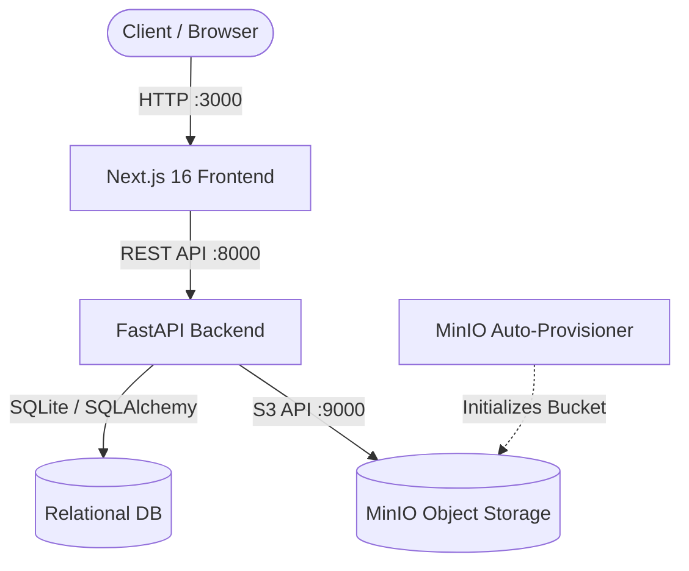

# 🔒 Virtual Data Room (VDR)

[-black?style=flat-square&logo=next.js)](https://nextjs.org/)
[](https://fastapi.tiangolo.com/)
[](https://www.python.org/)
[](https://www.typescriptlang.org/)
[](https://tailwindcss.com/)
[](https://min.io/)
[](https://www.docker.com/)

An **institutional-grade Virtual Data Room (VDR)** and regulatory compliance vault built for private equity due diligence, corporate M&A deals, SEC regulatory filings, and immutable auditing.

---

## 🌟 Key Features

### 🔍 1. Zero-Download Split-Pane Document Previewer
* **Resizable Split-Pane Slider:** Smooth draggable left handle allowing dynamic panel resizing (`380px` compact sidebar $\rightarrow$ `50%` split $\rightarrow$ `85%` full focus width) with double-click snap presets and user preference persistence.
* **Embedded Pointer-Shield:** Built-in event shielding prevents pointer-lock and frame-dropping while dragging over embedded PDFs and images.
* **Live Native Formats:**
  * **PDF Viewer (`PdfViewer`):** Embedded live document viewing, fullscreen toggle, and dedicated stream preview.
  * **High-Res Image Viewer (`ImageViewer`):** Multi-format support (`.png`, `.jpg`, `.jpeg`, `.gif`, `.svg`, `.webp`, `.bmp`) with zoom scaling (30% to 250%), 90° rotation, and reset controls.
  * **Interactive JSON Tree (`JsonViewer`):** Collapsible syntax tree with formatted indentation.
  * **Text & Markdown (`TextViewer`):** Line-numbered syntax viewer with embedded compliance risk banners.

### 🛡️ 2. Regulatory Compliance & Risk Pinning Engine
* **Clause-Level Violation Tagging:** Pin regulatory violations and compliance warnings directly to document clauses and sections.
* **Multi-Tier Severity:** `High` (Critical / SEC covenants), `Medium` (Operational), `Low` (Informational).
* **Interactive Risk Inspector:** Inspect citation details, audit timestamps, and one-click resolution workflows for Compliance Officers.

### 🔐 3. 4x3 Granular Role-Based Access Control (RBAC)
* **Matrix Security Model:** Enforces document-level permissions across 4 institutional roles:
  * 👑 **Admin:** Full system control, document ingestion, permission editing, user management.
  * 🛡️ **Compliance Officer:** Document classification, regulatory flag assignment, flag resolution, audit exports.
  * 💼 **Advisor:** Deal evaluation, document viewing, collaboration, strict flag resolution controls.
  * 📋 **Auditor:** Read-only compliance inspection with restricted export/editing capabilities.
* **Live Role Switcher:** Instant role simulation in the navigation bar to test UI action-locking and permission gating in real time.

### 📁 4. Explorer & Document Management
* **Dual View Modes:** Responsive grid cards with security badges and dense sortable tables with multi-select checkboxes.
* **Hierarchical Tree & Breadcrumbs:** Deep folder navigation with path breadcrumbs.
* **Real-time Filter & Search:** Filter by sensitivity classification (`Confidential`, `Restricted`, `Internal Only`, `Public`), extension, or search keyword.
* **Batch Operations:** Multi-document downloads, bulk sensitivity reclassification, and folder management.

### 📜 5. Immutable Audit Trail
* **Comprehensive Activity Logging:** Records every upload, view, download stream, permission update, flag creation, and flag resolution.
* **Exportable Audit Logs:** Searchable audit drawer with one-click export for compliance reporting.

---

## 🏗️ System Architecture



| Layer | Technology | Description |
| :--- | :--- | :--- |
| **Frontend** | Next.js 16 (Turbopack), React 19, TypeScript | High-performance SPA with client-side state via Zustand |
| **Styling** | TailwindCSS, Lucide Icons | Obsidian dark/light design system with glassmorphic accents |
| **Backend** | FastAPI, Python 3.11, Uvicorn | Async REST API with OpenAPI documentation |
| **Database** | SQLAlchemy 2.0, SQLite / PostgreSQL | Relational schema for files, folders, permissions, and audit logs |
| **Object Store** | MinIO (S3-Compatible) | Scalable blob storage for binary and document assets |
| **Orchestration**| Docker & Docker Compose | Containerized multi-service deployment |

---

## 🚀 Quick Start (Docker Compose)

The easiest way to run the entire Virtual Data Room stack is with Docker Compose.

### 1. Clone the Repository
```bash
git clone https://github.com/LuckyMishrraa/virtual-data-room.git
cd virtual-data-room
```

### 2. Launch All Services
```bash
docker compose up --build -d
```

### 3. Access Services
* 🌐 **Frontend Application:** [http://localhost:3000](http://localhost:3000)
* ⚡ **FastAPI Swagger Docs:** [http://localhost:8000/docs](http://localhost:8000/docs)
* 🗄️ **MinIO S3 Web Console:** [http://localhost:9001](http://localhost:9001) (`User: minioadmin`, `Password: minioadmin`)

---

## 🛠️ Local Development (Manual Setup)

If you prefer to run services individually for active development:

### Prerequisites
* **Node.js:** v20+ & npm
* **Python:** v3.11+
* **MinIO:** Running locally or via Docker (`docker run -p 9000:9000 -p 9001:9001 minio/minio server /data --console-address ":9001"`)

### Backend Setup
```bash
cd backend
python -m venv venv
source venv/bin/activate  # On Windows: venv\Scripts\activate
pip install -r requirements.txt
uvicorn app.main:app --host 0.0.0.0 --port 8000 --reload
```

### Frontend Setup
```bash
cd frontend
npm install
npm run dev
```
Open [http://localhost:3000](http://localhost:3000) in your browser.

---

## ⚙️ Environment Variables

Create a `.env` file in the root directory (or use `.env.example`):

```env
# Frontend Configuration
NEXT_PUBLIC_API_URL=http://localhost:8000/api/v1

# Backend Configuration
PORT=8000
DATABASE_URL=sqlite:///./vdr.db

# MinIO S3 Object Storage Configuration
MINIO_ENDPOINT=localhost:9000
MINIO_PUBLIC_ENDPOINT=localhost:9000
MINIO_ACCESS_KEY=minioadmin
MINIO_SECRET_KEY=minioadmin
MINIO_BUCKET_NAME=vdr-documents
MINIO_SECURE=False
```

---

## 📡 API Overview

| Method | Endpoint | Description |
| :--- | :--- | :--- |
| `GET` | `/api/v1/files` | List all files with metadata, tags, and sensitivity |
| `POST` | `/api/v1/files/upload` | Upload document directly to MinIO and register in DB |
| `GET` | `/api/v1/files/{id}/content` | Stream binary content (inline preview / download) |
| `GET` | `/api/v1/files/{id}/download-url` | Generate secure download URL |
| `PUT` | `/api/v1/files/{id}/permissions` | Update 4x3 RBAC matrix for a file |
| `POST` | `/api/v1/files/{id}/flags` | Pin a compliance risk flag to a section |
| `DELETE`| `/api/v1/files/{id}/flags/{flag_id}`| Resolve / dismiss a compliance flag |
| `GET` | `/api/v1/audit-logs` | Retrieve immutable audit events |

Explore the interactive Swagger documentation at `http://localhost:8000/docs`.

---

## 🧪 Testing

Run backend tests:
```bash
cd backend
pytest
```

Run static shell scripts / validation:
```bash
./run_static_tests.sh
```

---

## 📄 License

This project is licensed under the MIT License — see the [LICENSE](LICENSE) file for details.
