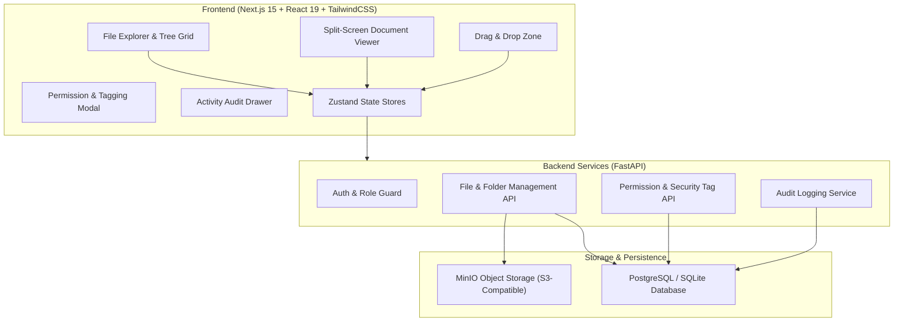
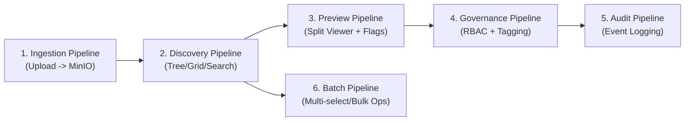
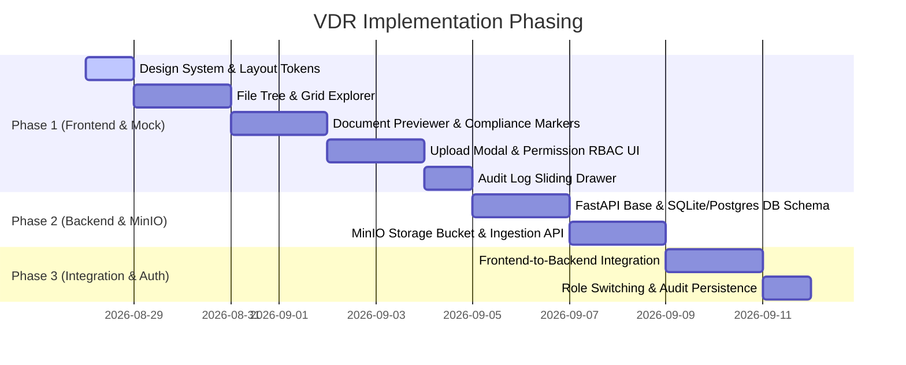

# Product Requirements Document (PRD)
# Secure Virtual Data Room (VDR) Platform

---

## 1. Document Control & Metadata

| Attribute | Details |
| :--- | :--- |
| **Product Name** | Secure Virtual Data Room (VDR) |
| **Version** | `1.0.0` |
| **Status** | Approved / Ready for Implementation |
| **Target Users** | Compliance Officers, Portfolio Managers, Auditors, Investment Advisors, Admins |
| **Primary Framework** | Next.js (App Router), TypeScript, Tailwind CSS, Zustand |
| **Backend & Storage** | FastAPI (Python), MinIO (S3-Compatible Object Storage), SQL Database |

---

## 2. Executive Summary & Problem Statement

### 2.1 The Problem
Financial institutions, private equity funds, and compliance teams handle tens of thousands of highly confidential documents (SEC disclosures, client agreements, audit records, M&A filings). Traditional generic cloud storage solutions or clunky file browsers lack:
- Granular, audit-ready permission enforcement
- Real-time compliance highlighting within document previews
- Non-repudiation and immutable activity audit trails
- Streamlined financial document workflows (split-screen inspection, rapid tagging)

### 2.2 Product Vision & Value Proposition
Build a high-performance, secure, and intuitive **Virtual Data Room (VDR)** that allows compliance officers and portfolio managers to effortlessly organize, search, preview, permission-tag, and audit confidential financial assets with sub-second responsiveness and bank-grade aesthetics.

---

## 3. User Personas & Role-Based Access Matrix (RBAC)

### 3.1 Personas
* **Compliance Officer & Portfolio Manager (Primary)**: Organizes fund folders, sets confidentiality classifications, reviews compliance text flags, and verifies audit integrity.
* **Administrator**: Manages workspace settings, user access, and master permissions.
* **Investment Advisor**: Views and shares allowed investor packs and performance summaries.
* **Auditor (Read-Only/Inspector)**: Reviews historical disclosures, inspects flagged excerpts, and tracks activity audit logs without modification rights.

### 3.2 Role Permission Matrix

| Role | View Documents | Upload & Edit Files | Manage Security Tags | Edit Permissions | Access Audit Trail |
| :--- | :---: | :---: | :---: | :---: | :---: |
| **Admin** | ✅ Full | ✅ Full | ✅ Full | ✅ Full | ✅ Full |
| **Compliance Officer** | ✅ Full | ✅ Full | ✅ Full | ✅ Full | ✅ Full |
| **Advisor** | ✅ Assigned Only | ✅ Within Scope | ❌ Read Only | ❌ No | 👁️ Limited View |
| **Auditor** | ✅ Read Only | ❌ No | ❌ Read Only | ❌ No | ✅ Full View |

---

## 4. System Architecture & Tech Stack



### 4.1 Frontend Stack
- **Framework**: Next.js (App Router), React 19, TypeScript (Strict Mode)
- **Styling**: Tailwind CSS with CSS custom properties for Dark/Light mode support
- **State Management**: Zustand 5 (modular stores for files, active document, permissions, audit log)
- **Icons & UI**: Lucide React, custom accessible modals, slide-out drawers, glassmorphic cards
- **Document Viewing**: Simple, robust renderers for Text/Markdown, Mock PDF/Image viewer, and formatted JSON viewer

### 4.2 Backend & Storage Stack
- **API Framework**: FastAPI (Python 3.11+)
- **Object Storage**: **MinIO** (Self-hosted / local S3-compatible bucket for file binaries)
- **Metadata Database**: PostgreSQL / SQLite (via SQLAlchemy or SQLModel)

---

## 5. Detailed Functional Requirements

### 5.1 Module 1: Folder Hierarchy & File Explorer
* **Dynamic Tree & Grid Views**: Collapsible hierarchical tree sidebar + grid/table file view with responsive breadcrumbs.
* **Instant Search & Multi-Parameter Filtering**: Real-time keyword search, sorting by Name, Date Modified, File Type, and Sensitivity Level.
* **File & Folder Operations**: Folder creation, inline/modal renaming, single & multi-file selection.

### 5.2 Module 2: In-App Document Previewer Panel
* **Split-Screen Side Panel**: Text/Markdown syntax renderer, PDF/Image canvas mocks, formatted JSON data tree.
* **Compliance Text Highlighting**: Highlight overlays over flagged sections with inspection tooltips.

### 5.3 Module 3: Drag-and-Drop File Upload Engine
* **Upload Modal & Dropzone**: Multi-file dropzone with format validation, progress bars, and streaming to MinIO storage.

### 5.4 Module 4: Metadata Tagging & Access Control UI (RBAC)
* **Sensitivity Taxonomy**: Visual badges (`Confidential`, `Restricted`, `Internal Only`, `Public`).
* **Permission Modal**: 4x3 granular rights matrix (View, Edit, Share) for Admin, Compliance Officer, Advisor, and Auditor.

### 5.5 Module 5: Activity Audit Log Drawer
* **Sliding Timeline Drawer**: Chronological event logs (`Uploaded`, `Viewed`, `Downloaded`, `Flagged`, `Renamed`, `Permission Changed`) with actor avatars, roles, and timestamps.

---

## 6. Core Pipelines & End-to-End User Stories (Working Version)

This section details the user stories, preconditions, acceptance criteria, and edge-case handling for each of the 6 core operational pipelines of the VDR.



---

### 6.1 Pipeline 1: Document Ingestion & Storage Pipeline

#### **US-1.1: Drag-and-Drop Single & Batch File Ingestion**
* **As a** Compliance Officer or Portfolio Manager,  
  **I want to** drag and drop single or batch financial documents (`.pdf`, `.txt`, `.md`, `.json`, `.png`) into the upload dropzone,  
  **So that** I can rapidly ingest assets into the active folder without manual file navigation errors.
* **Preconditions**:
  * User is authenticated and active role has `canEdit` permission for the target folder.
* **Acceptance Criteria**:
  * **Given** I am in a folder `/Funds/Q3-Disclosures/`,  
    **When** I drag one or more files over the dropzone area,  
    **Then** an animated, high-contrast dropzone border activates with visual "Drop files to upload" feedback.
  * **When** I release the files,  
    **Then** an Upload Queue Modal opens displaying each file's name, size, mime type, and animated progress bar (`Queued` → `Uploading` → `Stored`).
  * **When** the upload completes,  
    **Then** the document binary is streamed to the MinIO `vdr-documents` bucket, metadata is saved to the database, and the active directory view updates immediately without full page reload.
* **Edge Cases & Error Handling**:
  * If a file exceeds 50MB or has an unsupported executable extension, reject with an inline warning badge: *"File exceeds 50MB limit"* or *"Unsupported file format"*.
  * If the network interrupts during upload, display a *"Retry"* button on the failed file card.

#### **US-1.2: Default Security Tag & Compliance Initialization on Ingest**
* **As a** Compliance Officer,  
  **I want** newly uploaded documents to automatically initialize with a default sensitivity tag (`Internal Only` or parent folder inheritance) and undergo instant compliance mock scanning,  
  **So that** no file enters the data room in an unclassified or unmonitored security state.
* **Acceptance Criteria**:
  * **Given** a successful file upload,  
    **When** the backend / mock store records the item,  
    **Then** it automatically assigns `sensitivity: 'Internal Only'` and generates baseline permission records matching parent folder policy.

---

### 6.2 Pipeline 2: File Navigation, Search & Discovery Pipeline

#### **US-2.1: Dual-Mode Tree & Grid Traversal with Breadcrumb Navigation**
* **As an** Auditor or Portfolio Manager,  
  **I want to** explore nested directory hierarchies via a collapsible sidebar tree and interactive grid/table with breadcrumbs,  
  **So that** I can navigate multi-tier fund portfolios intuitively.
* **Acceptance Criteria**:
  * **Given** a nested hierarchy (`Root > Fund Alpha > 2026 Filings > Compliance`),  
    **When** I click nested tree items or double-click grid folder cards,  
    **Then** the main viewport renders the folder contents smoothly and the breadcrumb bar updates in real-time.
  * **When** I click any parent crumb in the breadcrumb bar (e.g. `Fund Alpha`),  
    **Then** the explorer immediately navigates back to that level.
  * **When** I toggle between `Grid View` and `Table/List View`,  
    **Then** the layout switches seamlessly while preserving the current folder location and active item selection.

#### **US-2.2: Real-time Multi-Parameter Search & Instant Sorting**
* **As a** Compliance Officer,  
  **I want to** search file names and filter by Sensitivity Level or file format, and sort by multiple fields,  
  **So that** I can instantly pinpoint high-risk or recently modified disclosures among large document sets.
* **Acceptance Criteria**:
  * **Given** a folder containing numerous files,  
    **When** I type a keyword into the search bar,  
    **Then** results filter in real-time (<50ms latency) without page flicker.
  * **When** I apply a sensitivity filter (e.g., `Confidential`),  
    **Then** only documents tagged as `Confidential` are rendered.
  * **When** I select `Sort by: Sensitivity Level`,  
    **Then** items are strictly ordered: `Confidential` → `Restricted` → `Internal Only` → `Public`.

---

### 6.3 Pipeline 3: In-App Document Inspection & Compliance Flagging Pipeline

#### **US-3.1: Zero-Download Split-Screen Document Preview**
* **As a** Compliance Officer or Auditor,  
  **I want to** select any document and inspect its content in a split-screen side panel without downloading raw files to my device,  
  **So that** I can review confidential disclosures securely and rapidly.
* **Acceptance Criteria**:
  * **Given** any file in the explorer,  
    **When** I click on the file card or click the "Preview" action,  
    **Then** the viewport transitions into a split-screen layout (explorer left, preview panel right).
  * **When** previewing Text/Markdown (`.txt`, `.md`),  
    **Then** it renders syntax-formatted typography with clean line spacing.
  * **When** previewing JSON (`.json`),  
    **Then** it renders an interactive collapsible tree with colored key-value syntax.
  * **When** previewing PDF or Images (`.pdf`, `.png`, `.jpg`),  
    **Then** it renders in an embedded canvas viewer with zoom in/out and page controls.
  * **When** I click the close button or press the `Escape` key,  
    **Then** the preview panel closes and restores full explorer width.

#### **US-3.2: Compliance Flag Inspection & Visual Highlight Overlays**
* **As a** Compliance Officer,  
  **I want** flagged compliance sections (e.g. *PII Detected*, *SEC Rule 17a-4 Disclosures*, *Confidentiality Clause*) visually highlighted within document previews,  
  **So that** I can immediately identify regulatory risks without manually scanning hundreds of lines.
* **Acceptance Criteria**:
  * **Given** a document with compliance flags,  
    **When** the document is loaded in the previewer,  
    **Then** highlight markers render over flagged sections with severity color coding (`High: Red`, `Medium: Amber`, `Low: Blue`).
  * **When** I hover or click on a highlight marker,  
    **Then** an interactive tooltip popover displays the rule citation, violation severity, timestamp, and compliance note.

---

### 6.4 Pipeline 4: Security Classification & RBAC Access Control Pipeline

#### **US-4.1: Sensitivity Tagging & Metadata Classification**
* **As a** Compliance Officer or Admin,  
  **I want to** update security sensitivity tags (`Confidential`, `Restricted`, `Internal Only`, `Public`) on files and folders,  
  **So that** confidentiality boundaries are visually clear and enforced.
* **Acceptance Criteria**:
  * **Given** any document,  
    **When** I change its classification via the tag selector dropdown,  
    **Then** the visual badge updates instantly across the explorer, previewer, and details drawer.
  * **When** sensitivity changes,  
    **Then** an automated audit log entry (`Permission Changed`) is triggered and logged.

#### **US-4.2: Role Permission Management & Real-time Action Gating**
* **As an** Administrator,  
  **I want to** open the Permission Editor Modal to assign `View`, `Edit`, and `Share` rights across roles (`Admin`, `Compliance Officer`, `Advisor`, `Auditor`),  
  **So that** restricted roles cannot perform unauthorized file modifications.
* **Acceptance Criteria**:
  * **Given** a file or folder,  
    **When** I open the Permission Modal,  
    **Then** a 4x3 role permission matrix is displayed with interactive checkboxes.
  * **When** I save updated rights (e.g., removing `canEdit` for `Advisor`),  
    **Then** the updated permission policy is saved to state/DB immediately.
  * **When** the active user role is switched to `Auditor` (Read-Only),  
    **Then** all modification actions (`Upload`, `Rename`, `Delete`, `Edit Permissions`) are disabled or hidden with a lock tooltip.

---

### 6.5 Pipeline 5: Audit Trail & Compliance Event Logging Pipeline

#### **US-5.1: Non-Repudiation Event Capture & Real-time Sliding Timeline Drawer**
* **As an** Auditor or Compliance Officer,  
  **I want** every major user interaction (`Uploaded`, `Viewed`, `Downloaded`, `Flagged`, `Renamed`, `Permission Changed`) automatically recorded in an immutable audit timeline drawer,  
  **So that** all document interactions are fully traceable for regulatory compliance.
* **Acceptance Criteria**:
  * **Given** a user performs an action (e.g. previews a file, modifies permissions, uploads a document),  
    **When** the action occurs,  
    **Then** a new audit record is generated containing:
      * Event ID & Target File Name
      * Action Type badge
      * Actor Avatar, Name, and Role
      * Specific change details & ISO timestamp (with relative time like "Just now")
  * **When** I click the "Audit Trail" button in the global header,  
    **Then** a sliding timeline drawer opens smoothly from the right edge showing chronological events.

#### **US-5.2: Audit Trail Filtering & File History Drill-Down**
* **As an** Auditor,  
  **I want to** filter audit events by specific file, user role, or action type,  
  **So that** I can conduct targeted audit reviews during SEC compliance audits.
* **Acceptance Criteria**:
  * **Given** the Audit Log Drawer is open,  
    **When** I select a file filter or action filter (e.g. `Flagged`),  
    **Then** the timeline filters instantly to display only relevant historical entries.

---

### 6.6 Pipeline 6: File Lifecycle & Batch Operations Pipeline

#### **US-6.1: Folder Creation, In-place Renaming & Safe Deletion**
* **As a** Portfolio Manager,  
  **I want to** create folders, rename documents with inline validation, and delete obsolete files with safety prompts,  
  **So that** fund document structures stay organized and accurate.
* **Acceptance Criteria**:
  * **Given** the explorer view,  
    **When** I click "+ New Folder",  
    **Then** a modal opens prompting for folder name with instant empty/duplicate name validation.
  * **When** I select "Rename",  
    **Then** an inline input activates pre-filled with the current file name (preserving file extension automatically).
  * **When** I delete a file,  
    **Then** a confirmation dialog warns before removing the file from state/storage.

#### **US-6.2: Multi-File Batch Selection & Bulk Operations**
* **As a** Compliance Officer,  
  **I want to** select multiple files using checkboxes and perform bulk operations (Batch Sensitivity Update, Batch Download, Batch Delete),  
  **So that** I can manage high-volume filing packages efficiently.
* **Acceptance Criteria**:
  * **Given** the file grid/table,  
    **When** I select 2 or more files,  
    **Then** a floating bottom action dock appears showing *"X items selected"* with action buttons.
  * **When** I click "Update Sensitivity → Confidential",  
    **Then** all selected items update their sensitivity tags simultaneously, and corresponding audit log entries are generated.

---

## 7. Data Models & API Specifications

### 7.1 Core TypeScript Interfaces
```typescript
export type SensitivityLevel = 'Confidential' | 'Restricted' | 'Internal Only' | 'Public';
export type UserRole = 'Admin' | 'Compliance Officer' | 'Advisor' | 'Auditor';
export type ActionType = 'Uploaded' | 'Viewed' | 'Downloaded' | 'Flagged' | 'Renamed' | 'Permission Changed';

export interface VDRFile {
  id: string;
  name: string;
  parentId: string | null; // null for root
  isFolder: boolean;
  sizeBytes: number;
  mimeType: string;
  fileExtension: string;
  sensitivity: SensitivityLevel;
  complianceFlags: ComplianceFlag[];
  permissions: Record<UserRole, { canView: boolean; canEdit: boolean; canShare: boolean }>;
  createdAt: string;
  updatedAt: string;
  storageKey?: string; // MinIO object reference
  contentPreview?: string; // Mock or raw text content
}

export interface ComplianceFlag {
  id: string;
  lineOrSection: string;
  severity: 'low' | 'medium' | 'high';
  reason: string;
  timestamp: string;
}

export interface AuditLogEntry {
  id: string;
  fileId: string;
  fileName: string;
  action: ActionType;
  actor: {
    id: string;
    name: string;
    role: UserRole;
    avatarUrl?: string;
  };
  details: string;
  timestamp: string;
}
```

### 7.2 FastAPI Endpoint Matrix

| Method | Endpoint | Description |
| :--- | :--- | :--- |
| `GET` | `/api/v1/files` | Fetch directory tree and file metadata (with search/filter query params) |
| `POST` | `/api/v1/files/upload` | Multipart upload to MinIO storage + DB metadata creation |
| `POST` | `/api/v1/folders` | Create a new folder |
| `PATCH` | `/api/v1/files/{id}` | Rename file or update sensitivity security tags |
| `GET` | `/api/v1/files/{id}/content` | Fetch file stream or raw content from MinIO |
| `PUT` | `/api/v1/files/{id}/permissions`| Update RBAC role permissions |
| `GET` | `/api/v1/audit-logs` | Retrieve chronological audit logs (filterable by file or user) |
| `POST` | `/api/v1/audit-logs` | Record a new audit log event |

---

## 8. Execution Strategy & Implementation Phasing



### Phase 1: High-Fidelity Frontend & Mock Data State *(High Priority)*
1. Set up Next.js App Router, Tailwind CSS design system with CSS custom properties (light & dark mode).
2. Implement Zustand mock file system state containing diverse realistic financial sample documents (.pdf, .txt, .json, .md).
3. Build the File Tree & Grid Explorer with live filtering, sorting, breadcrumbs, and multi-select.
4. Build the Split-Screen Document Previewer with compliance highlight markers and simple renderers.
5. Implement the Drag-and-Drop upload modal, Permission editor modal, and Audit log timeline drawer.

### Phase 2: FastAPI Backend & MinIO Object Storage *(Medium Priority)*
1. Scaffold FastAPI application with structured routers (`files`, `folders`, `permissions`, `audit`).
2. Integrate **MinIO** Python SDK (`minio` / `boto3`) to create buckets and handle multipart file streaming.
3. Configure database models for files, folders, permissions, and audit logs.

### Phase 3: End-to-End Integration & Role Auth *(Next Priority)*
1. Replace mock handlers with real Axios/fetch client communicating with FastAPI endpoints.
2. Implement live role-switcher UI and verify permission restrictions dynamically.
3. Persist audit logs to the backend database upon every user action.

---

## 9. Git Workflow & Engineering Standards

### 9.1 Repository Setup
* Maintain a clean dedicated repository for the Virtual Data Room project.
* Manual execution of Git branching, staging, committing, and pushing via the designated GitHub account.

### 9.2 Branching Convention
* Structure: `feature/<feature-name>`
* Examples:
  * `feature/file-explorer`
  * `feature/document-previewer`
  * `feature/permission-modal`
  * `feature/audit-log-drawer`
  * `feature/fastapi-minio-backend`

### 9.3 Commit & Pull Request Guidelines
* Standard **Conventional Commits**:
  * `feat: implement split-screen document previewer with compliance flags`
  * `feat: add MinIO multipart file upload endpoint in FastAPI`
  * `fix: correct breadcrumb path truncation on deep folder levels`
  * `style: tune dark mode contrast tokens for sensitivity badges`
* PRs must include structured descriptions, linked task milestones, and testing verification steps.

### 9.4 AI-Assisted Development Protocol
* Use AI assistance (Claude Code / Antigravity) for rapid implementation, refactoring, and test writing.
* Step-by-step verification and sanity checks required at every milestone to ensure clean, hallucination-free code.

---

## 10. Definition of Done (Acceptance Criteria)

- [ ] **File Management**: Functional tree and grid view, responsive breadcrumbs, instant keyword search, and multi-column sorting (Name, Date, Type, Sensitivity).
- [ ] **File Operations**: Drag-and-drop file upload modal with validation, folder creation, inline rename, and multi-file selection.
- [ ] **Document Previewer**: Split-screen side panel displaying Text, JSON, and PDF/Image mocks with highlighted compliance text tags.
- [ ] **Security & RBAC**: Sensitivity tags (`Confidential`, `Public`, `Internal Only`, `Restricted`) with functional permission modal assigning rights across the 4 roles.
- [ ] **Audit Trail**: Sliding timeline drawer recording chronological events (`Uploaded`, `Viewed`, `Downloaded`, `Flagged`, `Permission Changed`) with timestamps and user avatars.
- [ ] **UI/UX Excellence**: Flawless responsive layout, dark/light theme toggle, smooth micro-animations, and clean typography.
- [ ] **Backend & MinIO Ready**: Clear API contracts and MinIO storage integration for uploaded file binaries.
